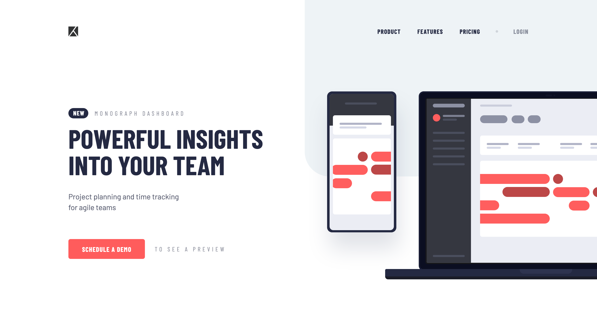

# Project Tracking Intro component

This is a solution to the [Project tracking intro component challenge on Frontend Mentor](https://www.frontendmentor.io/challenges/project-tracking-intro-component-5d289097500fcb331a67d80e). Frontend Mentor challenges help you improve your coding skills by building realistic projects.

## Preview and Links

<b>Open Preview</b>

 

 

| [Live Demo URL](https://ionstici.github.io/project-tracking-intro-component) | [Frontend Mentor](https://www.frontendmentor.io/solutions/project-tracking-intro-component-LRclL6b1VY) |
| ---------------------------------------------------------------------------- | ------------------------------------------------------------------------------------------------------ |

## Features

-   **Mobile Navigation:** JavaScript manages the navigation menu for mobile devices.
-   **Responsive Design:** Designed to look great and function well on all screen sizes.

## Tech Stack

-   **HTML5:** For the semantic layout of the component.
-   **CSS3:** For styling to ensure a clean and professional look.
-   **JavaScript:** For implementing the mobile navigation functionality.
